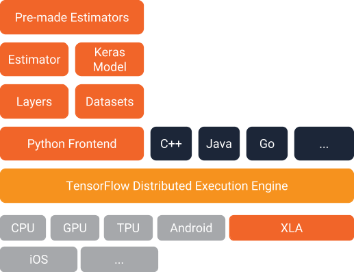
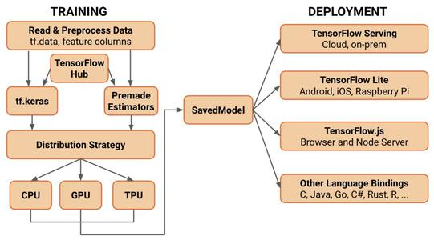

## 1. Intro

Google的开源软件库

- 采用数据流图，用于数值计算    
  - 数据流图
    - 节点：数据操作
    - 线：节点间的输入输出关系，代表数据流向  
    - 线上运输张量
    - 节点被分配到各计算设备运行
- 支持多种平台——GPU,CPU,移动设备
- 最初用于深度学习，变得越来越通用     


## 2. 版本变迁  

### 2.1 Tensorflow1.0      

#### 2.1.1 主要特性      

- XLA - Accelerate Linear Algebra 

  XLA: 专门针对线性运算的编译器，优化 tf 的运算速度，只会影响tf 的底层部分

  - 提升训练速度58倍
  - 可以在移动设备运行

- 引入更高级别的API - tf.layers / tf.metrics / tf.losses / tf.keras

- tf 调试器

- 支持docker镜像，引入tf serving服务，部署更加简洁

#### 2.1.2 Tensorflow1.0-架构  



- keras
- Estimator
- Datasets
- Layers
- Distribution Engine   


### 2.2 TensorFlow-2.0     

#### 2.2.1 主要特性    

- 使用`tf.keras`和`eager mode` 进行更简洁的模型构建
- 清除不推荐 API 和 减少重复，来简化API
- 鲁棒的跨平台部署
- 强大的研究实验

#### 2.2.2 TF-2.0-架构   



#### 2.2.3 特性的细节   

（1）简化的模型开发流程   

- 使用`tf.data`加载数据

- 使用`tf.keras`构建模型，也可使用`premade estimators`来验证模型
  - 使用`tensorflow hub`(预训练模型) 进行迁移学习
- 使用`eager mode`进行运行和调试
- 使用`Distribution Strategy`/ 分发策略，进行分布式训练
- 导出到`SaveModel`
- 部署模型


（2）强大的跨平台能力   

- `Tensorflow`服务
  - 直接通过http/rest、grpc/协议缓冲区
- `Tensorflow Lite`：安卓、ios、嵌入式设备部署
- `Tensorflow.js`：在JavaScript中部署模型
- 其他语言
  - C、java

（3）强大的研究实验

- `keras`功能API和子类API，允许创建复杂的拓扑结构
- 底层API可以和高层结合使用，完全的可定制
- 自定义训练逻辑，使用`tf.GradientTape`,`tf.custom_gradient`进行细粒度的控制
- 高级扩展：tensor2tensor


## 3. Tensorflow vs. PyTorch     

### 3.1 入门时间   

1. Tensorflow1.x    

   - 静态图

   - 学习额外的概念

     graph, session, variable, placeholder

   - 写样板代码

2. Tensorflow2.0    

   - 动态图
     - Eager mode 避免1.0缺点，直接集成在python中

3. PyTorch    

   - 动态图

   - Numpy的扩展，直接集成在python中

     

### 3.2 图创建与调试   

- tensorflow1.x 
  - 静态图，难以调试，需学习tfdbg调试
- tensorflow2.0 与 Pytorch
  - 动态图，python自带的调试工具


### 3.3 全面性   

 - pytorch 缺少

   - 沿维度翻转张量 (np.flip, np.flipud,)
   - 检查无穷与非数值张量
   - 快速傅里叶变换

- 随着时间变化，将会越来越接近

  

### 3.4 序列化和部署   

- Tensorflow 支持将会更广泛

  - 图保存为 protocol buffer
  - 跨语言
  - 跨平台

- pytorch 支持比较简单

  只有简单的导出


## Optional 1   

**Eager Execution：**

Tensorflow 1.4的Eager Execution在兼容老版本的基础上，提供了动态图以及其它的一些新特性。

- 无需Placeholder和Feed，可以直接使用numpy作为输入   

- 可以立即执行Operation。  

  例如输入图像数据(numpy)，立即输出卷积结果，并将结果转换为numpy。即可以将老版本中定义静态图的Operation直接当做函数来立即执行一个Operation。（老版本需要先利用Operation定义静态图，然后到Session中执行不可变的静态图，并且获取Operation的结果需要通过sess.run()和feed，非常麻烦）。

- 动态图特性使得Tensorflow可以使用python的if语句和循环语句来控制模型的结构，而不用通过`tf.cond`这种难用的函数来控制模型的解构。

- 动态图特性使得模型更便于调试，模型的运行过程与代码的运行过程一致。而在老版本的静态图中，网络的forward与backward都是黑箱操作，想加个print来输出过程中的变量都很难。

- 梯度的计算和更新也变成函数的调用，可由开发者自己调用。

- 上述的Eager Execution特性的实现，只需在代码顶部加上下面两行代码即可，其他的操作均兼容老版本的API：

  ```
  import tensorflow.contrib.eager as tfe
  tfe.enable_eager_execution()
  ```

#